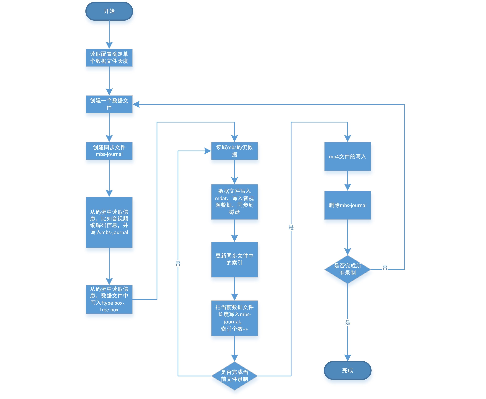

# 存储服务数据缓存设计
## 设计思路
存储服务为了支持直播回看，需要将正在直播中的数据保存起来，供后面回看的时候使用。而为了应对长时间的回看需求，把数据用单个文件存储来实现比较困难，因此考虑可以一次回看中的数据分多个存放。文件名和数据的时间区间，使用另一个文件来记录。这样每次查找的时候，先去找到目标数据在哪个文件中，再使用点播的方式来返回数据。因此要把数据实时封装为mp4格式。所以索引文件格式和数据文件名称格式以及mp4文件的封装和一致性是主要的部分。另外一个长时间不被访问的文件，服务应该回收其资源。

## 同步文件设计
## 数据文件名格式
### 存储配置文件
## mp4文件封装
###mp4 封装流程
参考ffmpeg的实现，把mbs码流封装为mp4格式，先写ftyp 、free 然后就一直写mdat 数据，期间把索引和其他信息保存在内存中，最后更新mdat 的大小，把其他box追加在文件的尾部。

###mp4 封装的数据一致性
#### ffmpeg的处理模式
ffmpeg 并不是实时把数据写到硬盘的而是当内存中的数据达到buffersize 的时候才去调用write写入，并且不调用fsync 同步。这样不能保证数据的一致性。
#### 数据同步文件
为了保证数据一致性，可以先创建一个数据同步文件，初始写入除了索引以外的其他信息。然后每次写入数据成功后都先在同步文件中记录当前数据文件的大小和索引个数。数据写入完成后同步数据文件成功后，在同步文件中更新数据文件的大小。

* 数据同步文件 mbs-journal

是不是从断电或者崩溃下恢复(以下简称异常),存储服务启动后看mbs-journal是否存在，如果存在说明之前正在录制中，根据mbs-journal找到对应的数据文件。再根据mbs-journal中的数据文件大小来截断数据文件，根据mbs-journal中记录的索引等信息修复数据文件索引和mp4，再删除mbs-journal。

* 数据一致

1.两次更新mbs-journal时出现的异常，可能导致当前文件大小没有更新到同步文件，重启后按照此前的大小，修复mp4文件，会丢失一点数据。
2.更新数据时出现异常，此时数据文件中可能有部分脏数据，但是mbs-journal是正常的，根据mbs-journal中保存的数据大小来修复。
3.如果更新mbs-journal成功，那么本次提交成功。

## 数据处理流程图

